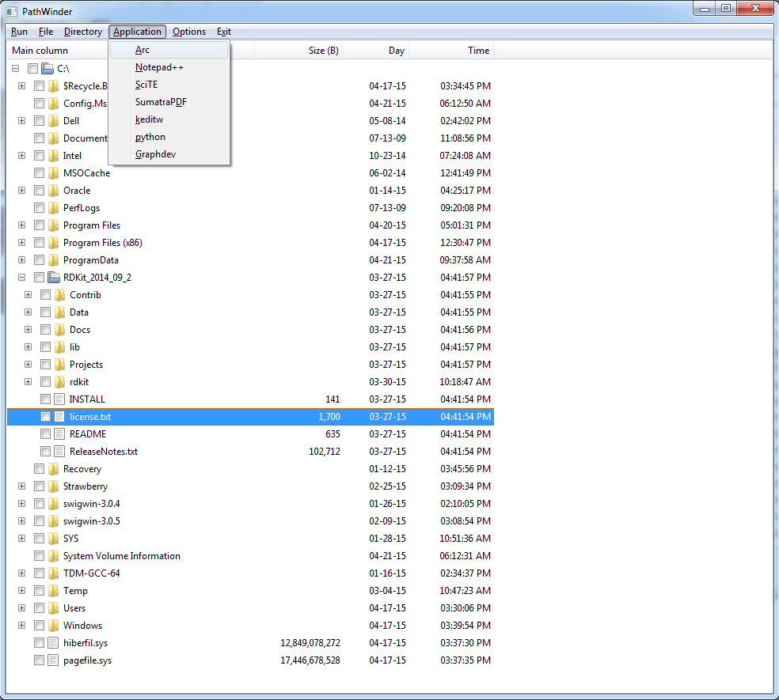

Winder
------

Written by Ian H. Bell, Ph.D., National Institute of Standards and Technology, 2015

Information
-----------
This program is inspired by an older 16-bit piece of software called PathMinder.

Being a 16-bit program, PathMinder cannot be used on 32-bit or 64-bit windows versions.  Thus winder was written in order to bring the nice ideas of PathWinder into modern Windows versions.  The program is written in wxpython, so it can just as easily be used on OSX or linux, with native appearance in each platform.

It allows for applications to be set up that can be easily accessed with two keystrokes - for instance A, S could be configured to open the selected file in SciTE (my text editor of choice).

Requirements
------------
This program has very limited external requirements:

- python (for now, python 2.7 is recommended, but in principle 3.x should be ok)
- wxpython (MUST be phoenix branch, download a wheel from http://wxpython.org/Phoenix/snapshot-builds/, install with ``pip``)
- cx_Freeze (for packaging script into executable)

It is recommended (but not required) that you use Anaconda to create an environment into which you install the phoenix version of wxpython so that you can have "classic" and "phoenix" versions of wxpython co-existing on your computer

Use
---
At the command prompt:

``python winder.py``

Packaging
---------
At the command prompt:

``python setup.py``

Find the output in the ``winder`` directory

License
-------
Public-domain - see LICENSE.txt

Screenshot
----------
N.B. - might not always be up to date

Explorer Integration
--------------------
In order to make winder accessible in Windows Explorer, open regedit, navigate to HKEY_CLASSES_ROOT\Directory\shell, make a key called "winder..." or whatever you want, and within that make a key called ``command`` which you make the path to the executable with a %1 at the end to pass the path to winder

